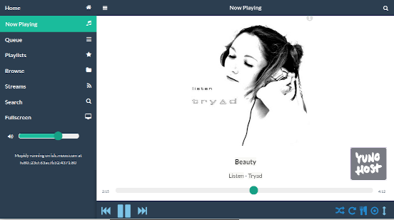

<!--
NOTA: Este README foi creado automáticamente por <https://github.com/YunoHost/apps/tree/master/tools/readme_generator>
NON debe editarse manualmente.
-->

# Mopidy para YunoHost

[](https://ci-apps.yunohost.org/ci/apps/mopidy/)


[](https://install-app.yunohost.org/?app=mopidy)

*[Le este README en outros idiomas.](./ALL_README.md)*

> *Este paquete permíteche instalar Mopidy de xeito rápido e doado nun servidor YunoHost.*  
> *Se non usas YunoHost, le a [documentación](https://yunohost.org/install) para saber como instalalo.*

## Vista xeral

Mopidy is an extensible music server written in Python.

Mopidy plays music from local disk, Spotify, SoundCloud, Google Play Music, and more. You edit the playlist from any phone, tablet, or computer using a variety of MPD and web clients.


**Versión proporcionada:** 3.4.2~ynh6

## Capturas de pantalla



## Documentación e recursos

- Web oficial da app: <https://www.mopidy.com>
- Documentación oficial para admin: <https://docs.mopidy.com/en/latest>
- Repositorio de orixe do código: <https://github.com/mopidy/mopidy>
- Tenda YunoHost: <https://apps.yunohost.org/app/mopidy>
- Informar dun problema: <https://github.com/YunoHost-Apps/mopidy_ynh/issues>

## Info de desenvolvemento

Envía a túa colaboración á [rama `testing`](https://github.com/YunoHost-Apps/mopidy_ynh/tree/testing).

Para probar a rama `testing`, procede deste xeito:

```bash
sudo yunohost app install https://github.com/YunoHost-Apps/mopidy_ynh/tree/testing --debug
ou
sudo yunohost app upgrade mopidy -u https://github.com/YunoHost-Apps/mopidy_ynh/tree/testing --debug
```

**Máis info sobre o empaquetado da app:** <https://yunohost.org/packaging_apps>
